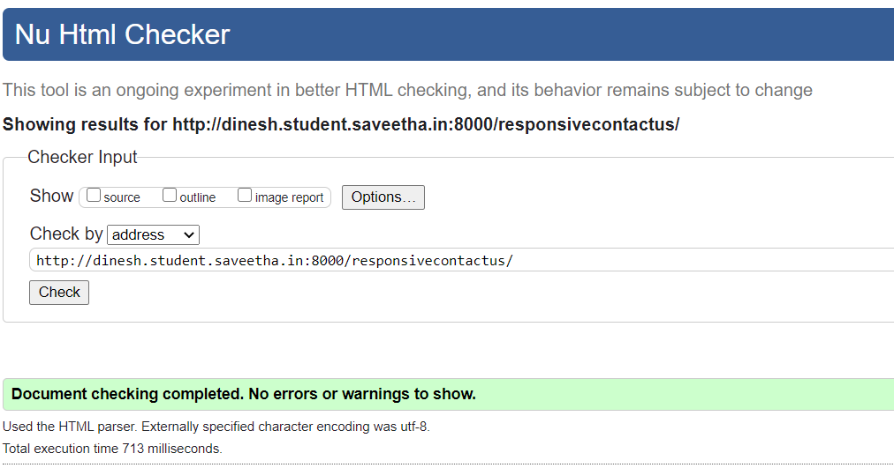

# Design of Responsive Website
## AIM:
To design a responsive website with two break points.

## DESIGN STEPS:
### Step 1: 
Requirement collection.
### Step 2:
Creating the layout using HTML and CSS.
### Step 3:
Updating the sample content.
### Step 4:
Choose the appropriate style and color scheme.
### Step 5:
Validate the layout in various browsers.
### Step 6:
Validate the HTML code.
### Step 7:
Create a database model and migrate the database.
### Step 8:
Retrieve data from database and display it in a dynamic webpage.
### Step 9:
Publish the website in the given URL.

## PROGRAM:

## responsivebase.html
```

<!doctype html>
<html lang="en">

<head>
    <!-- Required meta tags -->
    <meta charset="utf-8">
    <meta name="viewport" content="width=device-width, initial-scale=1, shrink-to-fit=no">

    <!-- Bootstrap CSS -->
    <link rel="stylesheet" href="https://maxcdn.bootstrapcdn.com/bootstrap/4.0.0/css/bootstrap.min.css"
        integrity="sha384-Gn5384xqQ1aoWXA+058RXPxPg6fy4IWvTNh0E263XmFcJlSAwiGgFAW/dAiS6JXm" crossorigin="anonymous">

    <title>DINESH Industries Limited</title>
</head>

<body>
    <div class="jumbotron">
        <div class="container text-center">
            <h1 class="display-3">DINESH Industries Limited</h1>
            <p class="lead">We manufacture high qualilty electronic products</p>
        </div>
    </div>
    <div class="container">
        <div class="row text-center">
            <div class="col-12 col-md-3"><a href="/responsivehome">Home</a></div>
            <div class="col-12 col-md-3"><a href="/responsiveproduct">Product</a></div>
            <div class="col-12 col-md-3"><a href="/responsivepeople">People</a></div>
            <div class="col-12 col-md-3"><a href="/responsivecontactus">Contact us</a></div>
        </div>
    </div>
    <div class="container">
        
        
    </div>
    <div class="container">
        <div class="row align-items-end">
            <div class="col text-center">
                Copyright © 2021 DINESH Industries Limited, Developed by DINESH
            </div>
        </div>
    </div>
    <!-- Optional JavaScript -->
    <!-- jQuery first, then Popper.js, then Bootstrap JS -->
    <script src="https://code.jquery.com/jquery-3.2.1.slim.min.js"
        integrity="sha384-KJ3o2DKtIkvYIK3UENzmM7KCkRr/rE9/Qpg6aAZGJwFDMVNA/GpGFF93hXpG5KkN"
        crossorigin="anonymous"></script>
    <script src="https://cdnjs.cloudflare.com/ajax/libs/popper.js/1.12.9/umd/popper.min.js"
        integrity="sha384-ApNbgh9B+Y1QKtv3Rn7W3mgPxhU9K/ScQsAP7hUibX39j7fakFPskvXusvfa0b4Q"
        crossorigin="anonymous"></script>
    <script src="https://maxcdn.bootstrapcdn.com/bootstrap/4.0.0/js/bootstrap.min.js"
        integrity="sha384-JZR6Spejh4U02d8jOt6vLEHfe/JQGiRRSQQxSfFWpi1MquVdAyjUar5+76PVCmYl"
        crossorigin="anonymous"></script>
</body>

</html>
```
## responsivehome.html
```



<div class="card">
  
  <div class="card-body">
    <h5 class="card-title">About Us</h5>
    <p class="card-text">DINESH Industries Limited, provides a broad range of semiconductor and infrastructure software applications that serve the data center, networking, software, broadband, wireless, and storage and industrial markets. Common applications for its products include: data center networking, home connectivity, broadband access, telecommunications equipment, smartphones, base stations, data center servers and storage, factory automation, power generation and alternative energy systems, displays, and mainframe operations and management, and application software development. Some of Silicon's core technologies and products include:
    <ul>
        <li>Memory Chips</li>
        <li>SATA HDD</li>
        <li>SATA SSD </li>
        <li>Broadband Modems</li>
        <li>Wifi Devices</li>
        <li>Switching Devices</li>
        <li>Optical Sensors</li>
    </ul> 
  </div>
</div>


```
## responsiveproduct.html
```



<div class="row text-center">
    <div class="col-12">
        <p class="lead">Our Premium Products</p>
    </div>
  
</div>
<div class="row text-center">
    <div class="card col-12 col-md-6 col-lg-3">
    
    <div class="card-body">
        <h5 class="card-title"><b> RAM </b></h5>
        <p class="card-text">(2666 MHz CL19 Desktop Memory)<br>Price: Rs.1,429.00</p>
        <a href="#" class="btn btn-primary">Buy now</a>
    </div>
    </div>
    <div class="card col-12 col-md-6 col-lg-3">
    
    <div class="card-body">
        <h5 class="card-title"><b>ROM</b></h5>
        <p class="card-text">(3200MHz CL16 XMP Desktop Memory)<br> Price: Rs.3,241.00</p>
        <a href="#" class="btn btn-primary">Buy now</a>
    </div>
    </div>
    <div class="card col-12 col-md-6 col-lg-3">
    
    <div class="card-body">
        <h5 class="card-title"><b>SSD</b></h5>
        <p class="card-text">(3200MHz PC4-25600 U-DIMM)<br>Price: Rs.10,999.00</p>
        <a href="#" class="btn btn-primary">Buy now</a>
    </div>
    </div>
    <div class="card col-12 col-md-6 col-lg-3">
    
    <div class="card-body">
        <h5 class="card-title"><b>RGB KEYBOARD</b></h5>
        <p class="card-text">(ELEGANT SPEED)<br>Price: Rs.6500.00</p>
        <a href="#" class="btn btn-primary">Buy now</a>
    </div>
    </div>
    <div class="card col-12 col-md-6 col-lg-3">
    
    <div class="card-body">
        <h5 class="card-title"><b>GAMING MOUSE</b></h5>
        <p class="card-text"> (WIRELESS)<br>Price: Rs.5450.00</p>
        <a href="#" class="btn btn-primary">Buy now</a>
    </div>
    </div>
    <div class="card col-12 col-md-6 col-lg-3">
    
    <div class="card-body">
        <h5 class="card-title"><b>HEADPHONE</b></h5>
        <p class="card-text">(SOUND QUALITY WITH EQUILIBRIUM)<br>Price: Rs.16,999.00</p>
        <a href="#" class="btn btn-primary">Buy now</a>
    </div>
    </div>
    <div class="card col-12 col-md-6 col-lg-3">
    
    <div class="card-body">
        <h5 class="card-title"><b>PENDRIVE</b></h5>
        <p class="card-text">(EXPANDABLE MEMORY OF 256GB)<br>Price: Rs.4,300.00</p>
        <a href="#" class="btn btn-primary">Buy now</a>
    </div>
    </div>
    <div class="card col-12 col-md-6 col-lg-3">
    
    <div class="card-body">
        <h5 class="card-title"><b>HARD DRIVE</b></h5>
        <p class="card-text"> (GOOD CAPACITY OF STORAGE)<br>Price: Rs.3,500.00</p>
        <a href="#" class="btn btn-primary">Buy now</a>
    </div>
    </div>
    <div class="card col-12 col-md-6 col-lg-3">
    
    <div class="card-body">
        <h5 class="card-title"><b>GAMING MOTHERBOARD</b></h5>
        <p class="card-text"> (GOOD SPEED)<br>Price: Rs.5,099.00</p>
        <a href="#" class="btn btn-primary">Buy now</a>
    </div>
    </div>
    <div class="card col-12 col-md-6 col-lg-3">
    
    <div class="card-body">
        <h5 class="card-title"><b>WIFI ROUTER</b></h5>
        <p class="card-text"> (Wi-Fi Modem Router,2x 5dBi)<br>Price: Rs.2,399.00</p>
        <a href="#" class="btn btn-primary">Buy now</a>
    </div>
    </div>
    <div class="card col-12 col-md-6 col-lg-3">
    
    <div class="card-body">
        <h5 class="card-title"><b>WIFI RECIEVER</b></h5>
        <p class="card-text"> (Portable Mini Travel Router (TL-WR902AC))<br>Price: Rs.2,199.00</p>
        <a href="#" class="btn btn-primary">Buy now</a>
    </div>
    </div>
    <div class="card col-12 col-md-6 col-lg-3">
    
    <div class="card-body">
        <h5 class="card-title"><b>FLOPPY DISK</b></h5>
        <p class="card-text"> (MEMORY OF 128GB EXPANDABLE)<br>Price: Rs.39,999.00</p>
        <a href="#" class="btn btn-primary">Buy now</a>
    </div>
    </div>
</div>


```
## responsivepeople.html
```



    <div class="jumbotron">
        <div class="container text-center">
            <h1 class="display-3">DINESH Private Limited</h1>
            <h5 class="display-6">crew people</h5>
        </div>
    </div>
    <div class="row text-center">
        <div class="col-12">
            <h5 class="display-6">Our Crew People</h5>
        </div>
    </div>
    <div class="row text-center">
        <div class="card col-12 col-md-6 col-lg-3">
            
            <div class="card-body">
                <h5 class="card-title">NEYMAR</h5>
                <p class="card-text">President of a company</p>
                <a href="https://en.wikipedia.org/wiki/Neymar" class="btn btn-primary">More Details</a>
            </div>
        </div>
        <div class="card col-12 col-md-6 col-lg-3">
            
            <div class="card-body">
                <h5 class="card-title">M.S.DHONI</h5>
                <p class="card-text">Cheif Executive Officer of a company</p>
                <a href="https://en.wikipedia.org/wiki/MS_Dhoni" class="btn btn-primary">More Details</a>
            </div>
        </div>
        <div class="card col-12 col-md-6 col-lg-3">
            
            <div class="card-body">
                <h5 class="card-title">RONALDO</h5>
                <p class="card-text">Cheif Operating Officer of a company</p>
                <a href="https://en.wikipedia.org/wiki/Cristiano_Ronaldo" class="btn btn-primary">More Details</a>
            </div>
        </div>
        <div class="card col-12 col-md-6 col-lg-3">
            
            <div class="card-body">
                <h5 class="card-title">RAHUL</h5>
                <p class="card-text">Cheif Financial Officer of a company</p>
                <a href="https://en.wikipedia.org/wiki/KL_Rahul" class="btn btn-primary">More Details</a>
            </div>
        </div>
        <div class="card col-12 col-md-6 col-lg-3">
            
            <div class="card-body">
                <h5 class="card-title">MESSI</h5>
                <p class="card-text">Cheif Legal Officer of a company</p>
                <a href="https://en.wikipedia.org/wiki/Lionel_Messi" class="btn btn-primary">More Details</a>
            </div>
        </div>
        <div class="card col-12 col-md-6 col-lg-3">
            
            <div class="card-body">
                <h5 class="card-title">HARDIK PANDYA</h5>
                <p class="card-text">Cheif Marketing Officerof a company</p>
                <a href="https://en.wikipedia.org/wiki/Hardik_Pandya" class="btn btn-primary">More Details</a>
            </div>
        </div>
    </div>
 

```
## responsivecontactus.html
```



<div class="card">
    
    <div class="card-body">
        <div class="card-title">
            <h5 class="col text-center">Contact Us</h5>
        </div>
        <p class="card-text">
            <hr>
        <div class="col text-center">
            <h4 class="lead">Email: dineshcompany@gmail.com</h4><br>
            <h4 class="lead">Phone: +1-1594227</h4><br>
            <h4 class="lead">Address: © DINESH Industries Limited,Mountain View, California, United-States</h4>
        </div>
        <hr>
    </div>
</div>

```

## OUTPUT:





## RESULT:
Thus, a responsive website with two break points is designed and is hosted in the URL 
http://dinesh.student.saveetha.in:8000/